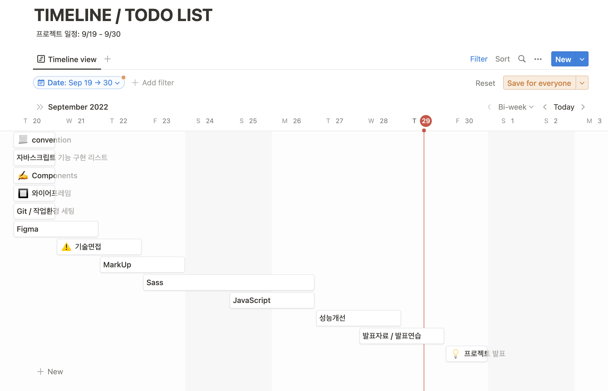
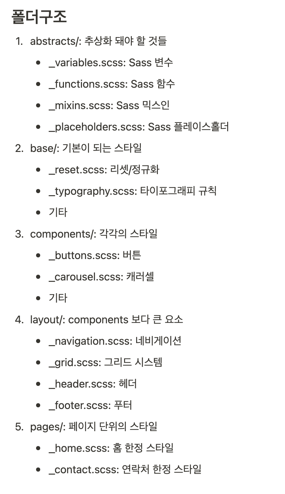
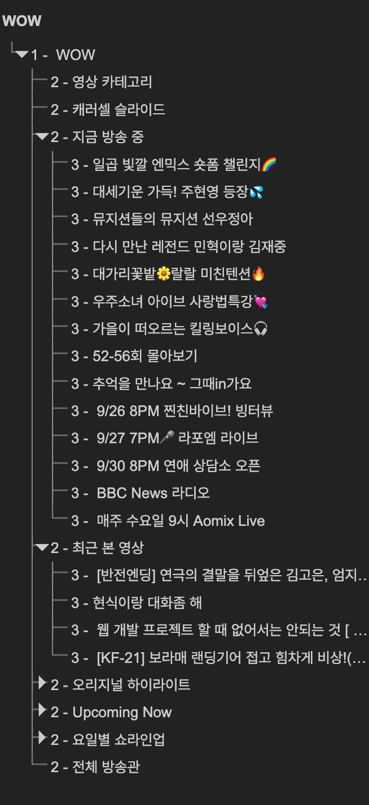
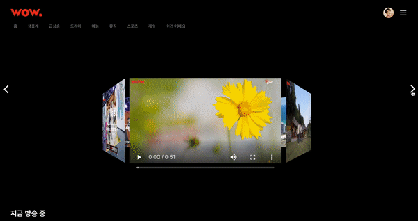

# 접근성을 고려한 네이버 NOW "WOW!"

## 프로젝트 결과물
https://connecto-wow.netlify.app/

## 프로젝트 개요
- 고정형 홈페이지인 네이버 영상 플랫폼 '네이버 나우'
- 의도적으로 앱 설치를 유도하기 위해서 데스크탑에서는 한정된 컨텐츠만 제공하여 UX의 만족도가 떨어진다고 생각하여, 반응형 홈페이지로 만들었습니다
- 따라서 하나의 HTML 파일로 viewport 크기에 따라 레이아웃이 변하는 것을 확인할 수 있습니다. 

## 역할 분담
팀원: 이재린, 박선우, 장현우
공통업무: 컴포넌트 믹스인 제작, 믹스인에 사용할 Scss 함수 제작
1. 이재린: 채널 페이지, 메인페이지 레이아웃, 
2. 박선우: 마이 페이지, 메인 index 페이지 
3. 장현우: 메인 캐러셀 영역, 팔로잉 페이지, 검색 API 연동

## 개발 문화
1. Code ManageMent: Prettier, ES Lint를 사용하여 코딩 컨벤션을 유지하였습니다. 
2. Design: Figma를 이용하여 프로젝트 페이지의 컴포넌트를 제작하였습니다. 
3. Communication: Slack, GoogleMeet를 사용하여 팀원들과 의사소통을 하였고, Notion을 통해 일정관리를 하였습니다. 



## 코딩 컨벤션
- 마크업, Scss  사용 시 BEM 컨벤션을 사용하였습니다. 
- Scss 폴더 구조는 아래와 같습니다. 

- @mixin, @function, %placeholder: 카멜 케이스를 사용하였으며, $변수는 케밥 케이스를 사용하였습니다. 

### 자세한 내용은 아래 링크를 확인해주세요.
https://jazzy-sneezeweed-14f.notion.site/convention-077c20ecc19f46f6a823ff5cbb0d42f3


## 프로젝트 시작 전 중점사항
프로젝트 작업 전 접근성을 고려한 WOW를 만들기 위해 중점적으로 고려해야할 사항에 대해서 정리하였습니다. 
1. 시멘틱 마크업
2. WAI-aria 사용
3. 스크립트를 사용한 키보드 화살표로 제어 가능
4. 스크린리더를 사용하는 사용자들도 인식 가능한 캐러셀 제작
5. 별점 평가 키보드 제어

---

### 1. ✅ Semantic Markup
- 섹셔닝 컨텐츠와 섹셔닝 루트를 준수하여 마크업하였습니다. 


- a11yHidden 클래스를 사용하여 IR기법으로 숨김 컨텐츠 처리를 해주었습니다. 

---

### 2. 🖥 WAI-aria
- aria-label 속성에 값을 사용하여 버튼, 비디오와 같은 요소에 부가적인 정보를 제공하였습니다.
```
 <button
    type="button"
    aria-controls="lineupTabpanel"
    aria-live="polite"
    aria-label="일요일 쇼라인업 보기"
    id="sunday"
    aria-selected="false"
    >
    일
</button>
```
---
### 3. ⌨ 스크립트를 사용한 화살표 키보드 접근 가능
자바스크립트를 사용하여 목록이 나열되어 있는 요소들은 화살표 키로 제어 가능하도록 구현하였습니다. 


- [controlArrokey.js](https://github.com/leejaelll/connecToWow/blob/master/public/js/controlArrowKey.js)을 클릭하면 키보드 제어 스크립트를 확인할 수 있습니다. 

---

### 4. 😎 스크린리더를 사용하는 사용자들도 인식 가능한 캐러셀 제작
기존 네이버 NOW에는 없던 기능으로, 3D 캐러샐을 구현하였습니다. 

- WAI-aria를 사용하여 스크린리더 사용자도 캐러샐에 대한 내용을 인식가능하도록 만들었습니다. 



-  [carousel.js](https://github.com/leejaelll/connecToWow/blob/master/public/js/carousel.js)을 클릭하면 캐러셀 구현 스크립트를 확인할 수 있습니다. 


### 5. 키보드로 제어 가능한 별점 평가 시스템
기존 네이버 NOW에는 없던 기능으로, 별점 평가 기능을 추가하였습니다. 

- 자바스크립트를 사용하여 접근한 상태의 별을 스페이스바로 눌렀을 때, 점수가 추가되는 기능을 구현하였습니다. 


- [starRating.js](https://github.com/leejaelll/connecToWow/blob/master/public/js/carousel.js)을 클릭하면 별점 평가 구현 스크립트를 확인할 수 있습니다. 

